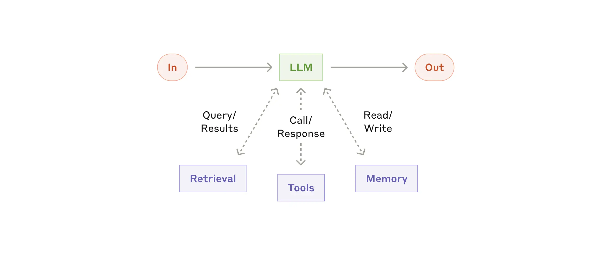
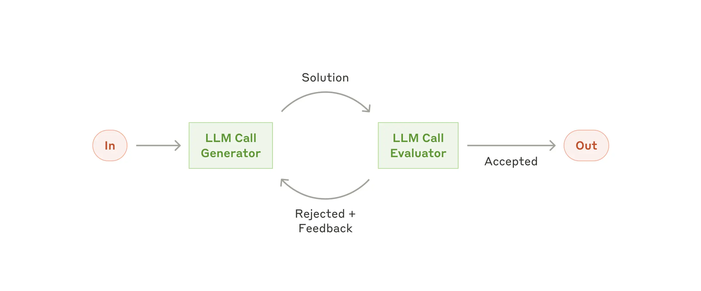

# PydanticAI Agents Demo

Based on [PydanticAI Examples](https://ai.pydantic.dev/examples/)

Requires these API Keys in .env:

```
GEMINI_API_KEY=YOUR_GEMINI_API_KEY
OPENAI_API_KEY=YOUR_OPENAI_API_KEY
WEATHER_API_KEY=tomorrow.io API KEY
GEO_API_KEY=YOUR_MAPBOX_API_KEY
GROQ_API_KEY=NOT GROK (xai) GROQ https://console.groq.com/home
```

### Run Examples

```
uv run examples/weather_agent.py
```

## Building Blocks, Workflows, Agents

[Building effective agents](https://www.anthropic.com/engineering/building-effective-agents)

## Building Block - Augmented LLM



## Workflows

### Prompt Chaining


This workflow is ideal for situations where the task can be easily and cleanly decomposed into fixed subtasks. The main goal is to trade off latency for higher accuracy, by making each LLM call an easier task.

### Routing


Routing works well for complex tasks where there are distinct categories that are better handled separately, and where classification can be handled accurately, either by an LLM or a more traditional classification model/algorithm.

### Parallelization


Parallelization is effective when the divided subtasks can be parallelized for speed, or when multiple perspectives or attempts are needed for higher confidence results. For complex tasks with multiple considerations, LLMs generally perform better when each consideration is handled by a separate LLM call, allowing focused attention on each specific aspect.

### Orchestrator Workers


This workflow is well-suited for complex tasks where you can’t predict the subtasks needed (in coding, for example, the number of files that need to be changed and the nature of the change in each file likely depend on the task). Whereas it’s topographically similar, the key difference from parallelization is its flexibility—subtasks aren't pre-defined, but determined by the orchestrator based on the specific input.

### Evaluator Optimizer



This workflow is particularly effective when we have clear evaluation criteria, and when iterative refinement provides measurable value. The two signs of good fit are, first, that LLM responses can be demonstrably improved when a human articulates their feedback; and second, that the LLM can provide such feedback. This is analogous to the iterative writing process a human writer might go through when producing a polished document.

## Agents


Agents can be used for open-ended problems where it’s difficult or impossible to predict the required number of steps, and where you can’t hardcode a fixed path. The LLM will potentially operate for many turns, and you must have some level of trust in its decision-making. Agents' autonomy makes them ideal for scaling tasks in trusted environments.


A coding Agent to resolve SWE-bench tasks, which involve edits to many files based on a task description

## Summary

Success in the LLM space isn't about building the most sophisticated system. It's about building the right system for your needs. Start with simple prompts, optimize them with comprehensive evaluation, and add multi-step agentic systems only when simpler solutions fall short.

When implementing agents, we try to follow three core principles:

1. Maintain simplicity in your agent's design.
2. Prioritize transparency by explicitly showing the agent’s planning steps.
3. Carefully craft your agent-computer interface (ACI) through thorough tool documentation and testing.

Frameworks can help you get started quickly, but don't hesitate to reduce abstraction layers and build with basic components as you move to production.